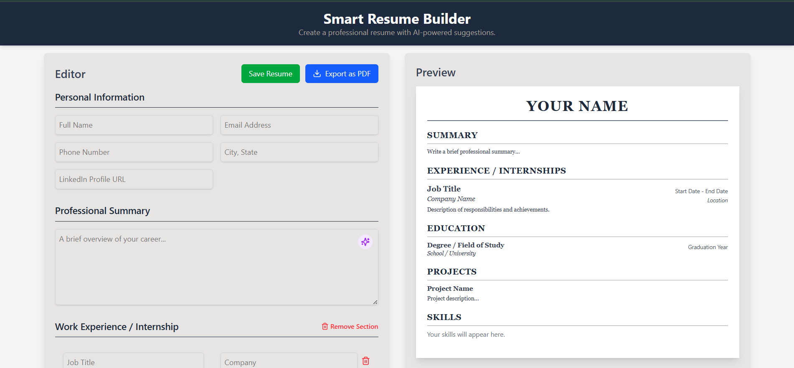

SMART RESUME BUILDER WITH AI SUGGESTIONS

1. The Smart Resume Builder is build to help user create a ATS friendly resume.
2. AI suggestion option available so that user can enhance their Profle summary and Project description.
3. The content is strategically written to capture the attention of recruiters and pass through automated screening systems.
4. Technologies used:- React, TailwindCSS, Lucid React icons, Node js, Axios, Google Gemini API, MongoDB.
5. The application features an interactive, dual-panel interface where users can input their professional information into a structured form on one side and see a live.

6. The following are the Screenshots of how the projects look like:

7. View the Project Reoprt on Smart Resume Builder using AI suggestions to get moe detailed informaton:
[text](<PROJECT REPORT.pdf>)